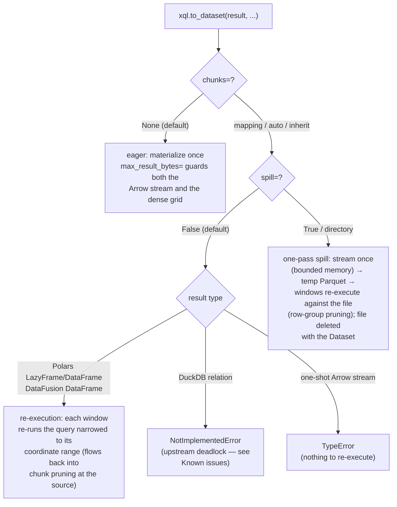

# Engines

xarray-sql translates **data, not queries**. It does not own a SQL
dialect, a query IR, or a transpiler: you pick a query engine and write
that engine's native SQL, using that engine's extension ecosystem
(spatial, H3, …) directly. xarray-sql implements the two seams no engine
builds for itself:

1. **register** — a lazy `xarray.Dataset` becomes a table on the
   engine's own connection, streamed as Arrow record batches only while
   a query executes.
2. **round-trip** — the engine's Arrow result plus the source Dataset as
   a *template* becomes a labeled `xr.Dataset` again: attrs, non-dim
   coordinates, and dtypes recovered. *SQL in, array out.*

Everything between the seams — geometry functions, dialects,
optimizers — belongs to the engine.

## DataFusion (default)

DataFusion is the built-in engine, wrapped in a session:

```python
import xarray_sql as xql

ctx = xql.XarrayContext()
ctx.from_dataset("era5", ds, chunks={"time": 24})
result = ctx.sql("SELECT ... FROM era5").to_dataset()
```

This is the deepest integration: the Rust `TableProvider` gives
partition pruning on dimension predicates, projection pushdown to the
storage layer, exact per-partition statistics for the optimizer, and a
lazy chunked round-trip (`to_dataset(chunks=...)`).

The generic entry point dispatches here too: `xql.register(ctx, "era5", ds)`
works on any `datafusion.SessionContext`.

### Relation to zarr-datafusion

[zarr-datafusion](https://crates.io/crates/zarr-datafusion) extends
DataFusion with SQL over Zarr stores natively (early days — a single
0.1.0 release at the time of writing) — for plain-Zarr sources that is
the engine-native path, the same role duckdb-zarr plays for DuckDB.
This library's role is complementary there too: anything xarray can
open (NetCDF, GRIB, Earth Engine via Xee, CF-decoded/virtual datasets,
in-memory arrays), and the round-trip from a query result back to a
labeled Dataset, which no engine extension provides.


## DuckDB (adapter)

```sh
pip install 'xarray-sql[duckdb]'
```

```python
import duckdb
import xarray_sql as xql

con = duckdb.connect()
xql.register(con, "era5", ds)                      # seam 1

con.sql("INSTALL spatial; LOAD spatial;")           # DuckDB's own shelf
rel = con.sql("""
    SELECT time, lat, lon, AVG(t2m) AS t2m
    FROM era5
    WHERE lat BETWEEN 40 AND 41
    GROUP BY time, lat, lon
""")

out = xql.to_dataset(rel, template=ds)              # seam 2
```

The adapter registers an `XarrayPushdownDataset` — a
`pyarrow.dataset.Dataset` subclass (the same pattern
[Lance](https://github.com/lancedb/lance) uses for `LanceDataset`), so
DuckDB hands each query's column list and pushed predicate to the
source. The scan then loads only the data variables the query mentions,
prunes chunks whose coordinate ranges cannot satisfy the predicate
(via Arrow's own guarantee simplification — sound for every predicate
shape), and prefetches surviving chunks on a thread pool. The table is
lazy, re-queryable, and a bounding-box query over a billions-of-pixels
raster answers in about a second because only the intersecting chunks
are ever read.

Pushed comparison filters are a correctness contract in DuckDB (it
deletes them from its own plan), so the scanner always applies the
exact expression via pyarrow — pruning is only an optimization on top.
`XarrayArrowStream`, the dependency-light re-scannable C-stream wrapper
without pushdown, remains available as a fallback.

As is standard in for all Xarray-SQL engines, users may provide a mapping of
groups of dimensions to their preferred table names, like so:

```python
xql.register(con, "era5", ds, table_names={
  ("time", "latitude", "longitude"): "surface",
  ("time", "level", "latitude", "longitude"): "atmosphere",
})

con.sql("SELECT AVG(temperature) FROM era5.atmosphere WHERE level = 500")
```

Mixed-dimension Datasets split as they do everywhere else, with one
DuckDB-specific wrinkle: `con.register` binds each flat table
(`era5_surface`) only for the connection's lifetime, never to the
catalog on disk, so it is mirrored as a view `era5.surface` in a schema
of its own only on **in-memory** connections. Both spellings hit the
same scan — pushdown and projection travel through the view — and the
dotted one is what keeps the SQL portable. On a file-backed connection
that view would either fail to create (read-only) or persist after its
flat table is gone (writable, once the connection is reopened), so
registration there warns and leaves the flat tables, which always work
either way.

Details that matter in production:

- **Finely partitioned axes** (e.g. hourly-chunked reanalysis time with
  hundreds of thousands of chunks) prune through a two-level shadow:
  a coarse pass over at most 1024 buckets, refined per surviving
  bucket — so pruning cost is bounded regardless of chunk count, and
  refinement is skipped when a predicate matches most of the axis.
- **Tuning** via `xql.register(con, name, ds, batch_size=...,
  prefetch=..., prefetch_bytes=..., coalesce_rows=...)`: `prefetch`
  bounds concurrent chunk loads, `prefetch_bytes` caps estimated bytes
  in flight, `coalesce_rows` merges runs of consecutive surviving
  chunks into single reads, `batch_size` caps rows per Arrow batch.
  See the [performance guide](performance.md#the-memory-contract).
- **Source parallelism matters as much as the adapter's**: rioxarray
  serializes GDAL tile reads behind a lock by default, which caps any
  scan at single-stream speed regardless of `prefetch`. Open rasters
  with `rioxarray.open_rasterio(..., lock=False)` — measured 6× on
  full scans of a 9-billion-pixel cloud GeoTIFF, making remote reads
  as fast as a local copy.


### Relation to duckdb-zarr

[duckdb-zarr](https://github.com/xqlsystems/duckdb-zarr) reads Zarr
stores natively inside DuckDB, with projection pushdown — for
plain-Zarr sources it is the engine-native path and will beat this
adapter. The adapter's role is complementary: anything xarray can open
(NetCDF, GRIB, Earth Engine via Xee, CF-decoded/virtual datasets,
in-memory arrays), and the round-trip from a DuckDB result back to a
labeled Dataset, which no engine extension provides.

## Polars (via the pyarrow dataset protocol)

```sh
pip install 'xarray-sql[polars]'
```

`xql.arrow_dataset(ds)` returns a real `pyarrow.dataset.Dataset`, so
any engine that consumes that protocol gets the same lazy scan with
projection pushdown and coordinate-range chunk pruning — no adapter
code at all. Polars works today:

```python
import polars as pl
import xarray_sql as xql

lf = pl.scan_pyarrow_dataset(xql.arrow_dataset(ds))
out = (
    lf.filter(pl.col("lat") > 0)
    .group_by("time")
    .agg(pl.col("t2m").mean())
    .collect()
)
xql.to_dataset(out, template=ds)   # polars frames speak Arrow PyCapsule
```

`arrow_dataset` wants a Dataset whose variables share one set of
dimensions; `xql.arrow_datasets(ds, "era5", table_names=...)` splits a
mixed-dimension one and hands back the tables named, reading the shared
dimension coordinates once for all of them.

```python
tables = xql.arrow_datasets(ds, "era5", table_names={...})

ctx = pl.SQLContext()
for table, dataset in tables.items():     # 'era5_surface', ...
  ctx.register(table, pl.scan_pyarrow_dataset(dataset))
```

Polars pushes its predicate and column selection into the dataset scan
(verified: a filtered group-by read 1 of 20 chunks and 3 of 5 columns),
and its results round-trip through `xql.to_dataset` unchanged. The
chunked round-trip is fully supported: windows re-execute on Polars'
streaming engine.


## ADBC (adapter; any database with a driver)

```sh
pip install 'xarray-sql[adbc]' adbc-driver-postgresql   # or -sqlite, -snowflake, ...
```

[ADBC](https://arrow.apache.org/adbc/) is a database-neutral API whose
drivers speak Arrow natively. `xql.register` accepts any ADBC DBAPI
connection, so PostgreSQL, SQLite, Snowflake, BigQuery, Flight SQL,
DuckDB, and every other database with an ADBC driver share one code
path:

```python
import adbc_driver_postgresql.dbapi
import xarray_sql as xql

con = adbc_driver_postgresql.dbapi.connect("postgresql://localhost/weather")
xql.register(con, "era5", ds)                       # seam 1: ingest
con.commit()

cur = con.cursor()
cur.execute("""
    SELECT time, lat, lon, AVG(t2m) AS t2m
    FROM era5
    WHERE lat BETWEEN 40 AND 41
    GROUP BY time, lat, lon
    ORDER BY time, lat, lon
""")
out = xql.to_dataset(cur, template=ds)              # seam 2
```

**Registration copies the data.** An ADBC database usually runs in
another process or on another machine, so it cannot call back into
Python to scan a lazy Dataset while a query runs. The adapter instead
streams the Dataset into a new table with ADBC's bulk ingest: chunks
are read on the same prefetching scan the DuckDB adapter uses
(`batch_size`, `prefetch`, `prefetch_bytes`, `coalesce_rows` tune it),
so memory stays bounded while the driver writes, and queries afterwards
run entirely in the database. Ingest what you intend to query —
`ds.sel(...)` a region or `ds[[...]]` a few variables first — rather
than a whole archive.

Options specific to this adapter:

- `mode="create"` (default) raises if the table exists; `"replace"`
  drops and recreates it; `"append"` and `"create_append"` add rows,
  which is how to load a long time series in slices.
- `temporary=True` creates temporary tables that the database drops
  when the connection closes — the closest match to the other
  engines' register-for-this-session behavior. Where the driver cannot
  create them (see the table below), registration raises rather than
  risk a permanent table: Trino's driver, for one, silently ignores
  the request.
- `ingest_options={...}` sets driver-specific options on each ingest
  statement — e.g. Spark's staging area,
  `{"spark.ingest.staging_area_uri": "s3://bucket/path"}`.
- **Commit after registering.** Ingest runs inside the connection's
  current transaction, as DB-API prescribes. The tables are visible to
  this connection at once, but other connections — a BI tool, a
  separate reader — see nothing until you call `con.commit()` (SQL
  Server even blocks them on the lock), and `con.rollback()` discards
  the tables. DuckDB's driver autocommits; MySQL commits DDL itself.

Mixed-dimension Datasets are ingested into a database schema named
after the Dataset, so `era5.surface` is the same SQL here as on
DataFusion and DuckDB. An existing schema is used as is, so a role
granted only that schema can register into it. On databases without
schemas (SQLite), and for temporary tables, the groups are created as
flat `era5_surface` tables instead (with a warning in the first case).
Where creating the schema fails *and* the failure aborts the
transaction (PostgreSQL without the `CREATE` privilege), registration
raises instead: call `con.rollback()`, then create the schema
beforehand or pass `temporary=True`.

**ClickHouse.** ClickHouse's
[ADBC driver](https://adbc-drivers.org/drivers/clickhouse/) (a preview
at the time of writing) can only append, so on ClickHouse the adapter
creates each table itself and then appends to it:

```python
from adbc_driver_manager import dbapi

# dbc install clickhouse
con = dbapi.connect(
    driver="clickhouse",
    db_kwargs={"uri": "http://localhost:8123/?user=default&password=..."},
)
xql.register(con, "era5", ds)
```

Pass credentials as URI query parameters, as above; credentials in the
URI's user-info part are not used. Driver 0.1.1 works with ClickHouse
26.8 but fails every query against 26.9 (`decompression error: incorrect
magic number`). [chDB](https://clickhouse.com/docs/chdb), ClickHouse
embedded in-process, takes the same path with no server:
`dbc install chdb`, then `driver="chdb"` and `uri="chdb://"`.

Tables are `MergeTree` sorted by their dimensions
(`ORDER BY (time, latitude, longitude)`), so ClickHouse's primary index
skips data on dimension filters much as chunk pruning does elsewhere.
Timestamps are declared `DateTime64(p, 'UTC')`, with the precision `p`
following the coordinate's resolution (9 for `datetime64[ns]`, 6 for
`datetime64[us]`), so a literal like `time >= '2020-01-01'` means UTC
rather than the server's local zone.
Mixed-dimension Datasets go into a ClickHouse *database* named after
the Dataset (`era5.surface`), and `temporary=True` creates `Memory`
tables. To choose the engine or sort key yourself, create the table
first and register with `mode="append"`. ClickHouse has no
transactions, so `mode="replace"` ingests into a staging table and
swaps it in with `EXCHANGE TABLES` only once the ingest succeeds; a
failed replace leaves the old table as it was.

**Tested databases.** Databases differ in how they quote identifiers,
whether they have schemas, which types they store, and what their
drivers support; the adapter keeps those facts in one table of
dialects and has a single code path. The test suite runs the same
contract — round-trips, every mode, temporary tables, mixed-dimension
naming, missing values, timedelta coordinates, the chunked round-trip —
against each database it can reach:

| Database | `name.group` as | Temporary tables | Notes |
|---|---|---|---|
| SQLite | flat `name_group` (no schemas) | yes | times stored as text (`2021-01-01 04:00:00…`), so plain literals compare correctly; timedeltas and unsigned integers as integers |
| DuckDB | schema | yes | |
| PostgreSQL | schema | yes | tables are `ANALYZE`d after ingest; a failed statement aborts the transaction; times to the microsecond; mixed-case names need quotes |
| MySQL, MariaDB | database | yes | backtick identifiers; the driver ignores the target schema, so the adapter switches the default database for the ingest; times to the microsecond; MariaDB joins without hash joins by default (see limitations) |
| ClickHouse, chDB | database | yes (`Memory`) | tables created by the adapter (above) |
| DataFusion | schema | no | mixed-case names need quotes |
| Trino | schema | no | ingest is slow, about 10k rows/s (see limitations) |
| SQL Server | schema | yes (queried as `#name`) | timedeltas and unsigned integers as integers; times to the microsecond |

Spark, BigQuery, Databricks, and Snowflake follow their drivers'
published feature tables (no temporary tables; backtick identifiers in
Spark, BigQuery, and Databricks; no target schema in Spark, whose
groups are flat) but are not exercised by the test suite; other
databases get standard SQL.

Where a database lacks a type, the adapter converts on the way in
rather than let the driver lose data silently. Unsigned integers widen
to the next signed width where there are none (PostgreSQL would
otherwise wrap a `uint64` above the int64 range around to a negative
number); a `uint64` too large for int64 raises `ValueError` instead.
Registering a time coordinate with sub-microsecond values on a database
that stores microseconds warns, and a name the database folds
(`Weather` on PostgreSQL) warns that it must be quoted in queries.
Where a database widens a type — SQLite
stores `float32` as `float64` and `bool` as an integer, MySQL `bool` as
`int8`, interval or text durations — `to_dataset` narrows a plain
`SELECT` back to the template's type; derived values such as an `AVG`
keep the result's type.

The cursor is a one-shot Arrow stream: `xql.to_dataset(cur, ...)`
round-trips eagerly, and `chunks=` needs `spill=True`.

## Serving over Flight SQL (no copy)

The adapters above bring an engine to the data. `xql.serve` does the
reverse and brings the data to remote clients: it starts an
[Arrow Flight SQL](https://arrow.apache.org/docs/format/FlightSql.html)
server over the same lazy tables `XarrayContext` uses.

```python
import xarray_sql as xql

server = xql.serve({"era5": ds}, port=8815)
server.wait()   # in a script: block until Ctrl+C
```

Any Flight SQL client on the same machine can then query `era5`; to
serve other machines, read [exposing a
server](#things-to-know-before-exposing-a-server) first. Clients include
ADBC's Flight SQL driver (Python, R, Go, Java), the Flight SQL
JDBC and ODBC drivers, and the SQL tools built on them. From Python:

```sh
pip install adbc-driver-flightsql
```

```python
import adbc_driver_flightsql.dbapi as flight_sql

con = flight_sql.connect("grpc://localhost:8815")
cur = con.cursor()
cur.execute("""
    SELECT time, AVG(t2m) AS t2m FROM era5
    WHERE lat BETWEEN 40 AND 41
    GROUP BY time ORDER BY time
""")
out = xql.to_dataset(cur, template=ds)   # template: the same Dataset, opened client-side
```

Nothing is copied. Each query is planned by DataFusion on the server
against lazy tables, so partition pruning on dimension predicates and
projection pushdown work exactly as they do in process: only the chunks
and variables a query touches are read from the source, only while the
query runs, and results stream back as Arrow record batches.

`xql.register(server, name, ds, table_names=...)` works on a
`xql.FlightSQLServer()` like on any other engine, including while it
serves. Mixed-dimension Datasets are served as `name.group` tables, and
clients can list tables with the standard Flight SQL metadata calls
(e.g. ADBC's `adbc_get_objects`).

### Tested clients

**Spark** reads through the
[Arrow Flight SQL JDBC driver](https://arrow.apache.org/docs/java/flight_sql_jdbc_driver.html)
and pushes its column selection and filters into the SQL it sends, so
they reach the server's chunk pruning:

```python
spark = (
    SparkSession.builder
    .config("spark.jars", "flight-sql-jdbc-driver-19.0.0.jar")
    .config("spark.driver.extraJavaOptions", "-Duser.timezone=UTC")
    .config("spark.sql.session.timeZone", "UTC")
    .getOrCreate()
)
era5 = (
    spark.read.format("jdbc")
    .option("url", "jdbc:arrow-flight-sql://server-host:8815/?useEncryption=false")
    .option("driver", "org.apache.arrow.driver.jdbc.ArrowFlightJdbcDriver")
    .option("dbtable", "era5")        # or "era5.surface", or "(SELECT ...) AS t"
    .load()
)
xql.to_dataset(era5.where("lat > 40").toArrow(), template=ds)
```

Run Spark's JVM in UTC (`-Duser.timezone=UTC`, as above). The JDBC
path shifts timestamps by the JVM's zone otherwise; the session time
zone alone does not prevent it.

**ClickHouse** (25.8+) reads through its `arrowFlight` table function,
which speaks plain Arrow Flight rather than Flight SQL. The dataset name
is a table, or a query that runs on the server:

```sql
SELECT avg(temperature) FROM arrowFlight('server-host:8815', 'era5.surface');

-- ClickHouse does not push filters into arrowFlight; put them in the
-- name to get the server's chunk pruning:
SELECT * FROM arrowFlight('server-host:8815',
    'SELECT time, t2m FROM era5.surface WHERE lat BETWEEN 40 AND 41');
```

Times arrive without a zone, so ClickHouse parses literals compared
with them in its server zone. Add `SETTINGS session_timezone = 'UTC'`
to queries that filter on time.

### Things to know before exposing a server

- **No authentication or TLS.** The server binds to `127.0.0.1` by
  default. To accept remote connections, bind `0.0.0.0` only inside a
  trusted network, or put it behind a proxy that authenticates and
  terminates TLS:

  ```python
  server = xql.serve({"era5": ds}, host="0.0.0.0", port=8815, memory_limit=8 * 2**30)
  ```
- **Read-only SQL.** DDL, DML, and other statements (`CREATE EXTERNAL
  TABLE`, `COPY`, `SET`, ...) are rejected, so clients cannot read or
  write the server's filesystem.
- **DataFusion's SQL, without xarray-sql's Python UDFs.** The
  `cftime()` and `reproject()` functions `XarrayContext` registers are
  not available on the server.
- **Bound its memory.** Any client can send an expensive `ORDER BY`,
  join, or aggregation. `memory_limit=` (bytes) caps what those hold at
  once: a query that needs more spills to disk where it can and fails
  otherwise, and the server keeps serving. It is unbounded by default.
  Chunk reads aren't counted, so also cap the process itself (a
  container or cgroup memory limit) before serving untrusted clients.
- **Only the served Datasets are reachable.** Besides rejecting writes,
  the server doesn't resolve file paths or URLs as tables
  (`SELECT * FROM '/etc/hosts'` fails).
- **One process serves every query.** Chunk reads happen in the server
  process, so size it (and `chunks=`) for the concurrent load you
  expect.

## Engine support matrix

What each integration provides. Known issues and constraints live on
[Known issues & limitations](limitations.md).

| | DataFusion | DuckDB | Polars | ADBC |
|---|---|---|---|---|
| Register | `XarrayContext` / any `SessionContext` | `xql.register(con, name, ds)` | `pl.scan_pyarrow_dataset(xql.arrow_dataset(ds))` | `xql.register(con, name, ds)` (copies into the database) |
| Projection pushdown | yes | yes | yes | n/a (the database's own tables) |
| Chunk pruning on dim predicates | yes | yes | yes | n/a (the database's own indexes) |
| Eager round-trip (`xql.to_dataset`) | yes | yes | yes | yes (pass the cursor) |
| Chunked round-trip (`chunks=`) | re-execution | `spill=True` [^spill-only] | re-execution (streaming engine) | `spill=True` |
| `geometry` column ([geospatial](geospatial.md#geoarrow-point-geometry-columns)) | annotated WKB passes through | native `GEOMETRY` (`"wkb"` encoding) | plain binary/struct | driver-dependent |
| Mixed-dimension datasets | one schema, `name.group` tables | `name.group` views over `name_group` tables | `xql.arrow_datasets(ds, name)`, one per group | `name.group` tables in a schema; `name_group` without schemas |
| Naming those tables (`table_names=`) | yes | yes | yes | yes |
| Version floor | bundled (core dependency) | `duckdb >= 1.4` (tested on 1.5) | tested on `polars 1.42` | `adbc-driver-manager >= 1.12` (see [tested databases](#adbc-adapter-any-database-with-a-driver)) |

[^spill-only]: Why DuckDB relations do not re-execute — and two other
    engine-specific issues worth knowing — is explained on
    [Known issues & limitations](limitations.md#engine-specific-issues).

## The lazy round-trip across engines

`xql.to_dataset(result, chunks=...)` reconstructs a query result as a
*chunked, lazy* `xr.Dataset`: each output chunk re-executes the engine's
query narrowed to that chunk's coordinate window on first access. Over a
table registered through xarray-sql, the window's range predicate flows
back into chunk pruning at the source — accessing one output chunk reads
only the source chunks it maps onto.



**Choosing:** re-execution pays per window — right when you'll touch a
few windows of a huge result. Spill pays one full pass plus temporary
disk — right when you'll touch most of the result, when the producer
is a DuckDB relation, or when all you have is a one-shot stream.

Two knobs matter at scale:

- `coords="template"` trusts the template's coordinate arrays instead of
  running one `DISTINCT` query per dimension — construction then reads
  nothing at all. Only valid when the result spans the template's full
  extent (an unfiltered scan). On ARCO-ERA5 (1.32M hourly chunks) this
  builds a lazy view over a 1.37-trillion-row table in ~0.3 s with zero
  source reads; a one-day window then computes in ~2 s reading only the
  source chunks under the window.
- Contiguous windows become two-literal range predicates the engine can
  push and the source can prune on; stepped or fancy selections fall
  back to explicit value lists (exact, just less prunable).

With `spill=True`, the result is streamed **once** (bounded memory)
into a temporary Parquet file and windows re-execute against that
file — the right shape when most of the result will be touched, the
only chunked option for one-shot Arrow streams, and the required path
for DuckDB relations (see the DuckDB section above). Polars/DataFusion
re-execution remains the default for window-at-a-time access over huge
results.

## Adding an engine

An adapter implements one small contract
(`xarray_sql.backends.base.EngineAdapter`): `matches(con)` recognizes
the engine's connection object without importing the engine, and
`register(con, name, ds, chunks=...)` attaches the Dataset as a table.
Arrow C streams are the common wire; pushdown quality is where adapters
differ. The round-trip needs no per-engine work as long as the engine
can hand back Arrow.

A complete adapter, modeled on the DuckDB one:

```python
from xarray_sql.backends.base import register_adapter
from xarray_sql.backends.pyarrow import XarrayPushdownDataset

@register_adapter
class AcmeAdapter:
    """Registers Datasets on acme.Connection objects."""

    @staticmethod
    def matches(con) -> bool:
        # type inspection only, so `acme` stays an optional dependency
        return type(con).__module__.split(".")[0] == "acme"

    @staticmethod
    def register(con, name, ds, *, chunks=None, **kwargs):
        dataset = XarrayPushdownDataset(ds, chunks, **kwargs)
        con.register_arrow(name, dataset)  # the engine's own API
        return con
```

`xql.register(con, "t", ds)` then dispatches here whenever `matches`
recognizes the connection. Engines that consume the pyarrow dataset
protocol (DuckDB, Polars) get projection pushdown and chunk pruning for
free; an engine that only accepts Arrow streams can register
`XarrayArrowStream(ds)` instead, trading pushdown away.
