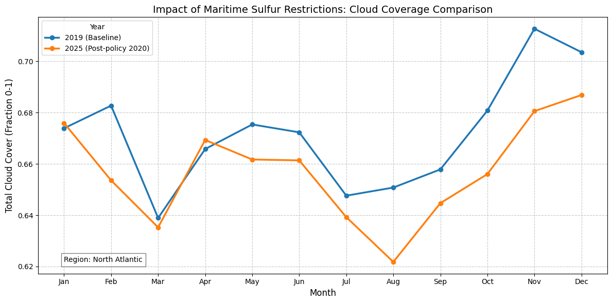

# Examples

A query result can be consumed two ways: as a flat pandas DataFrame
(`to_pandas`) or written back to an Xarray Dataset (`to_dataset`). This computes
a climatology — the mean annual cycle, one value per month of the year — and
shows both.

> **Note:** this example also needs `pooch` and a netCDF backend (for the
> tutorial download) and `matplotlib` (for the plot):
> `pip install pooch netCDF4 matplotlib`.

```python
import xarray as xr
import xarray_sql as xql

ds = xr.tutorial.open_dataset('air_temperature')

ctx = xql.XarrayContext()
ctx.from_dataset('air', ds, chunks=dict(time=100))

clim = ctx.sql('''
  SELECT
    CAST(date_part('month', "time") AS INTEGER) AS month,
    AVG("air") AS air
  FROM
    "air"
  GROUP BY
    CAST(date_part('month', "time") AS INTEGER)
  ORDER BY
    month
''')

# Option 1: a flat pandas DataFrame.
clim.to_pandas().head()

# Option 2: round-trip back to an Xarray Dataset and plot the annual cycle as
# a time series. `to_dataset()` infers dimensions from the registered table's
# surviving dims, so a GROUP BY on a real dimension needs no `dims=`. Here
# `month` is a derived column, not a registered dim, so name it explicitly;
# the variable's units are recovered from the registered table.
clim_ds = clim.to_dataset(dims=["month"])
clim_ds["air"].plot()
```

## Mixed-dimension datasets: ARCO-ERA5

When a Dataset has variables with differing dimensions (e.g. surface fields on
`(time, latitude, longitude)` and atmospheric fields on
`(time, level, latitude, longitude)`), `from_dataset` splits them into one
table per dimension group, registered together under a SQL schema named after
the first argument. [ARCO-ERA5][arco-era5] is a good example: 262 of its
variables are surface fields and 11 are atmospheric.

Open a year of ARCO-ERA5 and let SQL `WHERE` clauses do the filtering — the
library prunes time partitions and pushes dimension-column filters down. Use
the `table_names` kwarg to give each dimension group a friendly name:

> **Note:** reading from `gs://` requires `gcsfs` (`pip install gcsfs`).

```python
import xarray as xr
import xarray_sql as xql

# Open ARCO-ERA5 directly from GCS (anonymous read).
url = 'gs://gcp-public-data-arco-era5/ar/full_37-1h-0p25deg-chunk-1.zarr-v3'
full = xr.open_zarr(url, chunks=None, storage_options={'token': 'anon'})

# A full year of hourly ERA5 — all 273 variables. No spatial slicing on the
# xarray side; SQL WHERE clauses below express the filters. `chunks={'time': 1}`
# aligns Dask chunks to native Zarr chunks of shape (1, 37, 721, 1440) so
# chunk reads from GCS happen concurrently.
#
# Heads up: 262 of those variables are surface and 11 are atmospheric. The
# library pushes column projection down, so SELECT only fetches what you ask
# for — but `SELECT * FROM era5.surface` would try to pull every variable
# across the year (terabytes from GCS). Always SELECT specific columns.
ds = full.sel(time='2020').chunk({'time': 1})

ctx = xql.XarrayContext()
ctx.from_dataset('era5', ds, table_names={
    ('time', 'latitude', 'longitude'): 'surface',
    ('time', 'level', 'latitude', 'longitude'): 'atmosphere',
})
# Registers two tables under a SQL schema named 'era5': 'surface' and 'atmosphere'.

# Average 2m-temperature over the NYC area on the morning of 2020-01-01.
ctx.sql('''
  SELECT AVG("2m_temperature") - 273.15 AS avg_c
  FROM era5.surface
  WHERE time BETWEEN TIMESTAMP '2020-01-01'
                 AND TIMESTAMP '2020-01-01 05:00:00'
    AND latitude  BETWEEN 39 AND 40
    AND longitude BETWEEN 286 AND 287
''').to_pandas()

# Average temperature per pressure level, globally — the standard
# atmospheric temperature profile. Scans ~230M rows.
ctx.sql('''
  SELECT level, AVG(temperature) - 273.15 AS avg_c
  FROM era5.atmosphere
  WHERE time BETWEEN TIMESTAMP '2020-01-01'
                 AND TIMESTAMP '2020-01-01 05:00:00'
  GROUP BY level
  ORDER BY level DESC  -- surface (1000 hPa) first
''').to_pandas()
```

If you omit `table_names`, each table is named by joining its dimension names
with underscores, e.g. `era5.time_latitude_longitude` and
`era5.time_level_latitude_longitude`.

## GOES satellite imagery (scalar variables)

Real-world stores often mix gridded data with scalar (0-dimensional) metadata.
GOES satellite imagery, for example, pairs `(y, x)` image bands with dozens of
scalar variables such as `goes_imager_projection`. `from_dataset` groups all the
scalars into a single one-row table named `scalar`:

```python
import fsspec
import xarray as xr
from xarray_sql import XarrayContext

# A real GOES-16 ABI cloud-and-moisture file from NOAA's public bucket:
# (y, x) image bands alongside dozens of scalar metadata variables.
url = (
    'https://noaa-goes16.s3.amazonaws.com/ABI-L2-MCMIPM/2024/001/00/'
    'OR_ABI-L2-MCMIPM1-M6_G16_s20240010000281_e20240010000350_c20240010000426.nc'
)
ds = xr.open_dataset(fsspec.open_local(f'simplecache::{url}')).chunk(
    {'y': 250, 'x': 250}
)

ctx = XarrayContext()
ctx.from_dataset('goes', ds)

# The gridded bands and the scalar metadata are separate tables.
ctx.sql('SELECT COUNT(*) AS n FROM goes.y_x').to_pandas()['n'][0]  # -> 250000
ctx.sql('SELECT * FROM goes.scalar').to_pandas().shape            # -> (1, 89)
```

Override the default name like any other group with `table_names={(): 'metadata'}`.

A runnable version of the ERA5 example lives at
[`perf_tests/era5_temp_profile.py`](../perf_tests/era5_temp_profile.py).

[arco-era5]: https://github.com/google-research/arco-era5

## Cloud Coverage Comparison (ERA5)

This example compares monthly total cloud cover over North America and the North Atlantic
between 2019 (pre-policy baseline) and 2025 (post-IMO 2020 low-sulfur fuel mandate),
using ERA5 reanalysis data queried with xarray-sql.



```python
# Note: reading from gs:// requires gcsfs (pip install gcsfs).
import xarray as xr
import xarray_sql as xql
import matplotlib.pyplot as plt

# Open ARCO-ERA5 directly from GCS (anonymous read).
# https://github.com/google-research/arco-era5
url = 'gs://gcp-public-data-arco-era5/ar/full_37-1h-0p25deg-chunk-1.zarr-v3'
full = xr.open_zarr(url, chunks=None, storage_options={'token': 'anon'})

# ARCO-ERA5 is hourly data. To keep this example fast and avoid downloading
# gigabytes over GCS, we select a single time point per day (12:00 UTC).
# This reduces the data volume by 24x while preserving the seasonal monthly trend.
ds_daily = full[['total_cloud_cover']].sel(time=full.time.dt.hour == 12)

# As in the previous ARCO-ERA5 example, we align Dask chunks to native
# Zarr chunks with `chunks={'time': 1}` for concurrent GCS reads.
ds_2019 = ds_daily.sel(time='2019').chunk({'time': 1})
ds_2025 = ds_daily.sel(time='2025').chunk({'time': 1})

# ERA5 longitudes are 0-360 by default; remap to -180-180 for intuitive
# slicing and to align with standard geographic conventions.
ds_2019 = ds_2019.assign_coords(
    longitude=(((ds_2019.longitude + 180) % 360) - 180)
).sortby('longitude')
ds_2025 = ds_2025.assign_coords(
    longitude=(((ds_2025.longitude + 180) % 360) - 180)
).sortby('longitude')

# Register as two separate tables. We let the SQL engine combine them via
# UNION ALL, which avoids forcing Xarray to concatenate lazy remote datasets.
ctx = xql.XarrayContext()
ctx.from_dataset("cloud_2019", ds_2019)
ctx.from_dataset("cloud_2025", ds_2025)

# Calculate monthly average total cloud cover over the North Atlantic.
# The library pushes the WHERE clause filters down, so we only fetch the
# specific spatial bounds requested from the dataset.
result = ctx.sql('''
SELECT
    year,
    month,
    AVG(total_cloud_cover) as avg_cloud
FROM (
    SELECT
        CAST(EXTRACT(YEAR FROM "time") AS INTEGER) as year,
        CAST(EXTRACT(MONTH FROM "time") AS INTEGER) as month,
        total_cloud_cover
    FROM cloud_2019
    WHERE latitude BETWEEN 10 AND 75 AND longitude BETWEEN -170 AND -50

    UNION ALL

    SELECT
        CAST(EXTRACT(YEAR FROM "time") AS INTEGER) as year,
        CAST(EXTRACT(MONTH FROM "time") AS INTEGER) as month,
        total_cloud_cover
    FROM cloud_2025
    WHERE latitude BETWEEN 10 AND 75 AND longitude BETWEEN -170 AND -50
)
GROUP BY year, month
ORDER BY year, month
''')

# Materialize to a flat pandas DataFrame
df = result.to_pandas()
print(df.head())

# Pivot and plot the 12-month comparison
plot_df = df.pivot(index='month', columns='year', values='avg_cloud')
plt.figure(figsize=(12, 6))
plot_df.plot(kind='line', marker='o', linewidth=2.5, ax=plt.gca())
plt.title('Impact of Maritime Sulfur Restrictions: Cloud Coverage Comparison', fontsize=14)
plt.ylabel('Total Cloud Cover (Fraction 0-1)', fontsize=12)
plt.xlabel('Month', fontsize=12)
plt.xticks(range(1, 13), ['Jan', 'Feb', 'Mar', 'Apr', 'May', 'Jun', 'Jul', 'Aug', 'Sep', 'Oct', 'Nov', 'Dec'])
plt.grid(True, linestyle='--', alpha=0.7)
plt.legend(title='Year', labels=['2019 (Baseline)', '2025 (Post-policy 2020)'])
plt.text(1, plot_df.min().min(), "Region: North Atlantic",
         fontsize=10, bbox=dict(facecolor='white', alpha=0.5))
plt.tight_layout()
plt.show()
```
