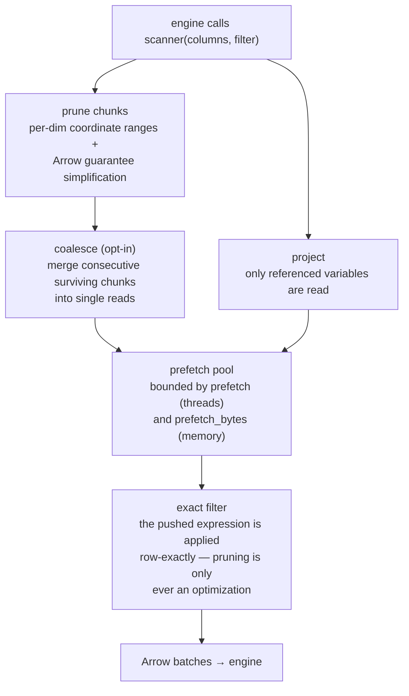
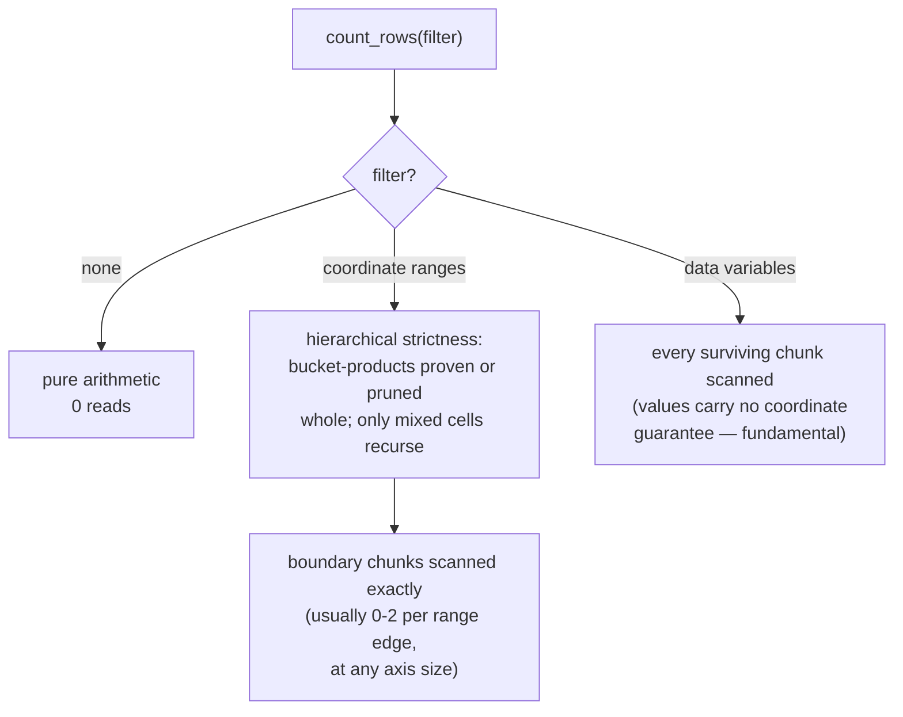
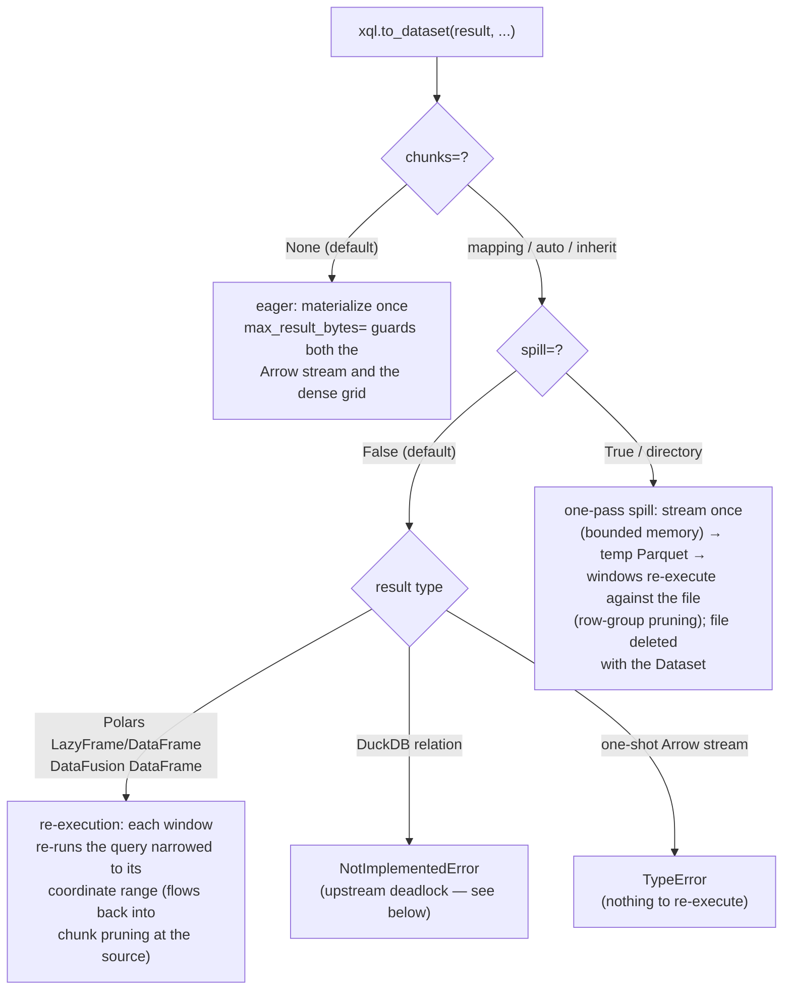

# Behaviors & limitations

The multi-engine backends make deliberate trade-offs. This page
catalogs them: what each behavior is, *why* it holds, and what to do
about it. Everything here is pinned by tests, and each "why" names the
mechanism, so behavior on cases this page doesn't list can be predicted
from the same rules.

## How a scan decides what to read

Every engine query over a registered table flows through one pipeline.
Knowing where each stage can and cannot help explains most behaviors on
this page:



Two invariants explain most of what follows:

1. **Pruning never decides correctness.** Engines (DuckDB in
   particular) delete the filter conjuncts they push down and never
   re-apply them; the scanner therefore always applies the exact
   expression. Every pruning behavior below is about *speed*, never
   about which rows come back.
2. **Only what reaches `scanner()` can prune.** Engines push simple
   column-vs-constant comparisons, `IN`, `IS NULL`, and boolean
   combinations — never function calls. Anything wrapped in a function
   (`ST_Within`, casts, arithmetic) is invisible to the source.

## Scan-side behaviors

### Geometry predicates alone read everything

`ST_Within(geometry, ...)` is a function call, so (invariant 2) it
never reaches the scanner: a geometry-only `WHERE` scans and encodes
every chunk — measured ~29x slower than the paired form on a 10M-row
grid. **Always pair geometry predicates with range conjuncts on the
coordinate columns**; [`bbox_conjuncts`][xarray_sql.bbox_conjuncts]
renders them from any geometry's envelope:

```python
poly = shapely.from_wkt("POLYGON (...)")
sql = (
    f"SELECT avg(risk) FROM eri "
    f"WHERE {xql.bbox_conjuncts(poly, x='x', y='y')} "     # prunes
    f"AND ST_Within(geometry, ST_GeomFromText('{poly.wkt}'))"  # refines
)
```

### Pruning is per-dimension on the scan path

Each dimension's surviving chunks are computed independently and
combined as a product. A predicate pairing *specific* ranges across
dims — `(t < a AND lat < b) OR (t > c AND lat > d)` — keeps the union
per dim, so the scan also reads the cross combinations (sound,
conservative). `count_rows` refines these away (see below); ordinary
scans accept the extra reads because per-dim indexes are what keep
million-chunk axes cheap.

### NaN coordinates disable pruning for their chunks

A NaN/NaT anywhere in a chunk's coordinate span poisons its min/max
guarantee, so that chunk is kept for every predicate. This is the
correct trade: a "range" that includes NaN would let engines whose NaN
ordering differs (DuckDB sorts NaN greatest) silently lose rows.
Chunks without NaN are unaffected.

### String, object, and cftime dimensions never prune

Chunk guarantees are built for numeric and datetime coordinates only;
predicates on other dimension types conservatively scan every chunk
(row-exactly, as always).

### `count(*)` cost depends on what the filter references



Coordinate-range counts are arithmetic at any breadth (a
near-universal filter over a million single-row chunks counts with
zero reads); the strictness pass also applies cross-dimension
information, so paired-range predicates count without reading the
cross combinations. Filters on **data variables** necessarily scan:
no coordinate guarantee can prove anything about values.

### Memory is bounded by what's in flight, not data scanned

Peak scan memory ≈ `prefetch × block size` (+ the engine's own state).
`coalesce_rows` makes blocks bigger (fewer round-trips, higher peak);
`prefetch_bytes` switches admission to an explicit byte budget so the
two can be sized independently. See
[Performance](performance.md#the-memory-contract) for measured numbers.

## Round-trip behaviors

### The decision tree



**Choosing:** re-execution pays per window — right when you'll touch a
few windows of a huge result. Spill pays one full pass plus temporary
disk — right when you'll touch most of the result, when the producer
is a DuckDB relation, or when all you have is a one-shot stream.

### DuckDB relations never re-execute from worker threads

Re-executing a DuckDB relation that scans a Python-backed table while
other Python threads start or stop deadlocks intermittently inside
duckdb-python (~50% of runs on CPython 3.12/macOS; unaffected by
`SET threads=1`, connection serialization, or pool pre-warming — the
identical topology through Polars never hangs). Until fixed upstream,
`chunks=` on a DuckDB relation raises immediately rather than hanging;
`spill=True` provides the chunked path by never re-executing at all.
The eager DuckDB round-trip is unaffected: every engine call runs on
one dedicated thread owned by the handle (which also serializes
access — derived relations share pending-query state upstream and
break under concurrent materialization).

### Eager materialization has an opt-in budget

`max_result_bytes=` errors cleanly — with the running size — at both
danger points: while collecting the Arrow stream, and before
allocating dense output arrays. The dense check matters for sparse
results: a diagonal of n rows reconstructs to an n×n coordinate-product
grid that can dwarf its Arrow payload. Unlimited by default.

### Lazy window semantics

- Contiguous selections become two-literal range predicates (prunable
  end to end). Stepped or fancy selections use explicit value lists —
  exact, just less prunable. On Polars, float value lists are rendered
  as degenerate ranges because upstream Polars translates float
  `is_in` literals imprecisely (silently matching nothing; reproduced
  on 1.42) — user-written queries should prefer `is_between` for float
  columns for the same reason.
- `coords="template"` skips per-dimension `DISTINCT` discovery; it is
  only valid when the result spans the template's full extent (an
  unfiltered scan).
- Pointwise (vectorized) indexers go through xarray's outer-then-gather
  fallback: correct, slower than slices.

## Registration behaviors

### Mixed-dimension datasets split into one table per dim group

DuckDB registration has no schema namespace, so variables with
different dims land in suffixed tables (`<name>_<dims>`), sharing one
set of coordinate reads. Query the group you need.

### Geometry encodings are per destination

`geometry_encoding="wkb"` (default) is what DuckDB ingests as a native
`GEOMETRY` (CRS attached). `"point"` emits GeoArrow-native separated
coordinates — zero-copy for GeoPandas/lonboard/geoarrow-rs — which
DuckDB does *not* consume (its `GEOMETRY` is WKB-like internally).
Pick per consumer; see [Geospatial in SQL](geospatial.md).

### View types are deliberately never emitted

One `string_view`/`binary_view` column in a schema disables DuckDB's
filter pushdown for the whole table (duckdb-python#227); the schema is
pinned to offset layouts by test.
