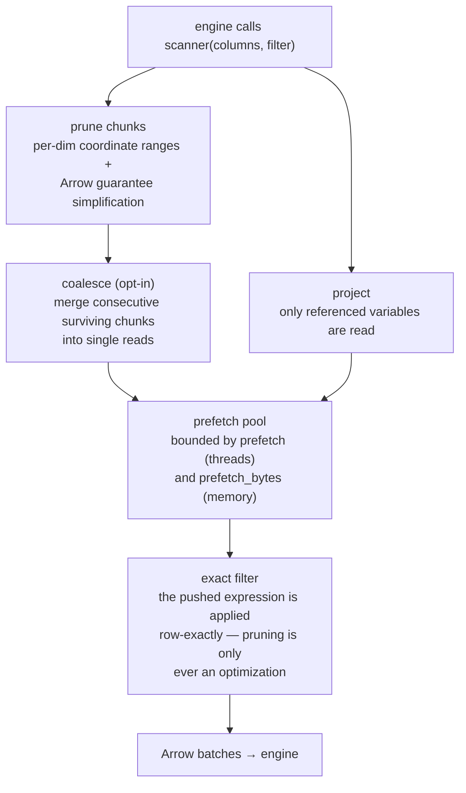
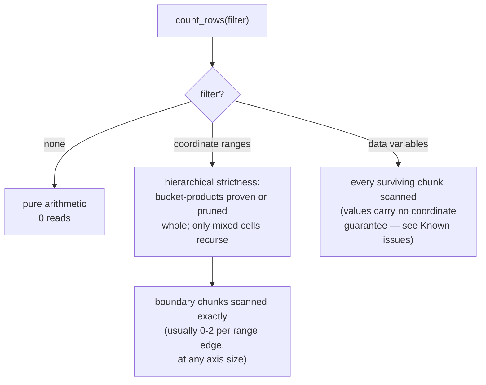

# Performance guide

How to get engine-limited speed out of registered xarray tables. Every
number below was measured on real cloud rasters (billions of pixels);
your mileage scales with network and core count, but the *ratios* are
structural.

## How a scan decides what to read

Every engine query over a registered table flows through one pipeline;
each tuning knob on this page acts on one of its stages:



Two invariants hold everywhere: pruning never decides correctness (the
exact expression is always applied — engines delete pushed conjuncts
from their own plans), and only what reaches `scanner()` can prune
(engines push plain comparisons, never function calls).

## Make the source read in parallel

The single biggest lever is usually the reader, not the engine.

**GeoTIFF / rioxarray**: `rioxarray.open_rasterio` serializes GDAL tile
reads behind a lock by default, capping every scan at single-stream
speed no matter how many threads the adapter runs. On GDAL ≥ 3.11 use
the natively thread-safe LIBERTIFF driver; on older GDAL pass
`lock=False`:

```python
da = rioxarray.open_rasterio(
    url, chunks={"x": 2048, "y": 2048},
    driver="LIBERTIFF",   # GDAL >= 3.11; else keep lock=False only
    lock=False,
)
```

Measured on a 9-billion-pixel public cloud GeoTIFF, full-table
aggregation: default open **277 s** → `lock=False` **43 s** →
LIBERTIFF + `GDAL_NUM_THREADS=ALL_CPUS` **24 s**. With parallel reads,
remote (`/vsicurl/`) matched a local copy of the same file — the
network was never the bottleneck, the lock was.

Remote-read environment preset worth exporting for `/vsicurl/` sources:

```python
os.environ.update(
    GDAL_NUM_THREADS="ALL_CPUS",
    GDAL_DISABLE_READDIR_ON_OPEN="EMPTY_DIR",
    VSI_CACHE="TRUE",
)
```

**Zarr**: zarr-python 3's async store defaults to only 10 concurrent
requests; raise it before opening remote stores:

```python
zarr.config.set({"async.concurrency": 128})
```

On a moderately sized windowed query (~40 chunks of 4096² uint8 per
variable, GCS) this was a modest gain (4.2 s → 3.7 s); it matters more
as chunk counts grow and chunks shrink. The obstore-backed
`zarr.storage.ObjectStore` is worth benchmarking for high-concurrency
workloads, but was not faster at this scale in our tests — measure
before switching.

## Choose chunk sizes for the scan, not just the store

Every chunk costs one prefetch task, one pivot call, and one shadow
fragment. Aim for **1–8 M rows per chunk** (e.g. 2048²–4096² pixels for
2-D grids). The same 10 M-row scan ran 1.7× faster in 4 chunks than in
20. Axes with hundreds of thousands of chunks still prune in
milliseconds (the shadow index is bucketed), but scanning them pays
per-chunk overhead.

## Tune the adapter knobs

```python
xql.register(con, "t", ds, prefetch=12, batch_size=262_144)
```

- `prefetch`: chunk loads kept in flight ahead of the engine. The
  default (4) saturates local CPU work; raise to 8–12 for remote
  sources where latency dominates. Memory scales with
  `prefetch × pivoted chunk size`.
- `batch_size`: rows per Arrow batch. The default (64 Ki) is fine;
  values between 64 Ki and 1 Mi measured within a few percent of each
  other.

## The memory contract

Peak scan memory is bounded by `prefetch × pivoted-block-size` plus the
engine's own aggregation state — it does not grow with the amount of
data scanned. Measured on ARCO-ERA5 over anonymous GCS: a one-month
full-globe aggregation (772M rows) peaks at the same RSS as the
one-week scan (174M rows), ~0.75 GB with the defaults.

`prefetch_bytes` caps *estimated bytes* in flight instead of block
count — set it when `coalesce_rows` makes blocks large or ragged.
The block size is the source chunk size unless `coalesce_rows` is set,
in which case in-flight units are merged blocks: raising
`coalesce_rows` buys fewer round-trips at proportionally higher peak
memory (`prefetch=16, coalesce_rows=8_000_000` peaked at ~1.2 GB on the
same scan while cutting wall time ~1.5-2x). Size the two together.

`count(*)`-shaped queries never pay scan memory at all: unfiltered
counts are pure chunk arithmetic, and filtered counts scan only the
boundary chunks the filter cannot prove — at any filter breadth; see
[What counting costs](#what-counting-costs).
## Let pushdown do its job

Selective queries are fast *because of their predicates*: bounding-box
`WHERE` clauses on dimension columns prune to intersecting chunks, and
only the variables a query references are read. Corollaries:

- Prefer explicit column lists over `SELECT *` on wide datasets.
- Spatial functions (`ST_Within`, ...) are not pushed down — pair them
  with a bounding-box predicate that is: the box prunes, the geometry
  refines.
- A query with no `WHERE` on dimension columns is a full scan on any
  engine; that's physics, not a missing optimization.

## Threads and DuckDB connections

Registered Python objects are connection-local in DuckDB: `con.cursor()`
does not inherit them, and one connection's result slot is not
thread-safe. For multithreaded querying, give each thread its own
cursor and register the *same* dataset object on it:

```python
dataset = xql.arrow_dataset(ds)
def worker():
    cur = con.cursor()
    cur.register("t", dataset)   # cheap; shares the pruning index
    ...
```

The dataset object itself is safe to share across threads (verified
under concurrent query load).

## What counting costs

`count(*)` never pays scan memory, and usually no I/O either:



Coordinate-range counts stay arithmetic at any breadth (a
near-universal filter over a million single-row chunks counts with
zero reads), and the strictness pass applies cross-dimension
information, so paired-range predicates count without reading the
cross combinations.

## Stop re-scanning: cache or pyramid

Registered tables are virtual — every query re-streams the source.
Statistics you ask repeatedly should pay the scan once. Two patterns,
for two question shapes:

### Cache one derived table (plain SQL)

There is no helper for this because none is needed: create a native
table from your query, sorted by the coordinate columns so the engine's
storage compresses the repetitive coordinates (DuckDB picks ALP/RLE on
sorted runs) and zone maps prune range predicates.

```sql
CREATE OR REPLACE TABLE grid_cube AS
SELECT FLOOR(y) AS lat, FLOOR(x) AS lon, klass, COUNT(*) AS n
FROM grid GROUP BY 1, 2, 3
ORDER BY lat, lon;

SELECT * FROM grid_cube WHERE lat = -32;  -- native speed
```

One engine quirk to know: on DataFusion, DDL is a lazy plan — collect
it or nothing happens:

```python
ctx.sql("CREATE OR REPLACE TABLE grid_cube AS ...").collect()
```

### Pyramids: one cube, every zoom level (plain SQL)

When the *resolution* of the question varies — dashboards, maps,
"country then province then plot" drill-downs — build a
multi-resolution cube: bin the grid into cells once, then roll coarser
levels up from finer ones without ever rescanning the source. Think
raster overviews / map-tile pyramids, in SQL. Like caching, this is
plain engine SQL — two statements and a loop:

```python
BASE = 0.05  # level-0 cell size, in coordinate units

# Level 0: the ONLY scan of the source, binned to integer cell indices.
con.sql(f"""
    CREATE OR REPLACE TABLE grid_pyramid AS
    SELECT 0 AS level, x_idx, y_idx,
           x_idx * {BASE} AS x_bin, y_idx * {BASE} AS y_bin,
           count(*) AS n,
           sum(CASE WHEN klass >= 4 THEN 1 ELSE 0 END) AS hits
    FROM (
        SELECT CAST(FLOOR(x / {BASE}) AS BIGINT) AS x_idx,
               CAST(FLOOR(y / {BASE}) AS BIGINT) AS y_idx, *
        FROM grid
    )
    GROUP BY x_idx, y_idx
""")

# Each coarser level halves the indices and adds up the level below.
for level in range(1, 6):
    cell = BASE * 2**level
    con.sql(f"""
        INSERT INTO grid_pyramid
        SELECT {level} AS level,
               CAST(FLOOR(x_idx / 2.0) AS BIGINT) AS x_idx,
               CAST(FLOOR(y_idx / 2.0) AS BIGINT) AS y_idx,
               CAST(FLOOR(x_idx / 2.0) AS BIGINT) * {cell} AS x_bin,
               CAST(FLOOR(y_idx / 2.0) AS BIGINT) * {cell} AS y_bin,
               sum(n) AS n, sum(hits) AS hits
        FROM grid_pyramid
        WHERE level = {level - 1}
        GROUP BY CAST(FLOOR(x_idx / 2.0) AS BIGINT),
                 CAST(FLOOR(y_idx / 2.0) AS BIGINT)
    """)
```

(On DataFusion, `.collect()` each statement — DDL/DML plans are lazy.)

Smallest possible example of what this builds — a 4x4 grid of pixels
valued 1..16 on a 2x2-degree extent, `BASE = 1.0`, three levels; the
entire resulting table:

```text
 level  x_idx  y_idx  x_bin  y_bin   n  total
     0      0      0    0.0    0.0   4   14.0   ┐ four 1-degree cells,
     0      1      0    1.0    0.0   4   22.0   │ 4 pixels each — the
     0      0      1    0.0    1.0   4   46.0   │ only scan of the
     0      1      1    1.0    1.0   4   54.0   ┘ source
     1      0      0    0.0    0.0  16  136.0   ← the 4 cells, added up
     2      0      0    0.0    0.0  16  136.0   ← same again (extent < cell)
```

Because each level is *added up* from the one below, only decomposable
statistics roll up losslessly — sums, counts (rolled up with `sum`),
minima, maxima. An average is a sum plus a count divided at query time:
`SELECT total / n FROM pyr WHERE level = 2` gives 8.5, exactly the mean
of pixels 1..16.

Querying picks the level whose cell size matches what you render:

```sql
-- Country-wide overview: a few hundred pre-aggregated rows, ~1 ms —
-- vs grouping every pixel of the source (minutes on a remote raster).
SELECT x_bin, y_bin, hits / n AS share
FROM grid_pyramid WHERE level = 5;

-- Zoomed into one province: same cube, finer level, range filter.
SELECT x_bin, y_bin, hits / n AS share
FROM grid_pyramid
WHERE level = 1
  AND x_bin BETWEEN -58.5 AND -57.0 AND y_bin BETWEEN -29.0 AND -28.0;
```

Two details the recipe encodes on purpose: cells are tracked as
**integer indices** and only labeled with float origins
(`x_bin = x_idx * cell`), because rebinning float origins level over
level occasionally lands boundary points in a different parent cell;
and filter `x_bin`/`y_bin` with **ranges**, not equality (they are
floats). Both statements stay within the SQL DuckDB and DataFusion
share; the recipe is pinned by tests on both engines.

## The round-trip is optimized for grids

`xql.to_dataset` locates rows by arithmetic when an axis is uniformly
spaced (any regular raster or time step, ascending or descending) and
reshapes without any scatter when the result arrives grid-ordered.
Sparse or irregular results fall back to a positional scatter
automatically. If you want the raw sub-array of a registered Dataset
rather than a relational answer, plain `ds.sel(...)` is the direct
path — SQL adds value when the question is relational.

