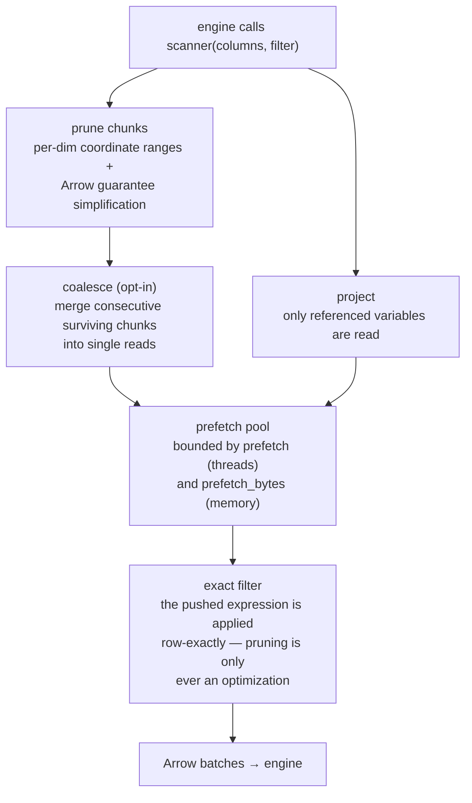
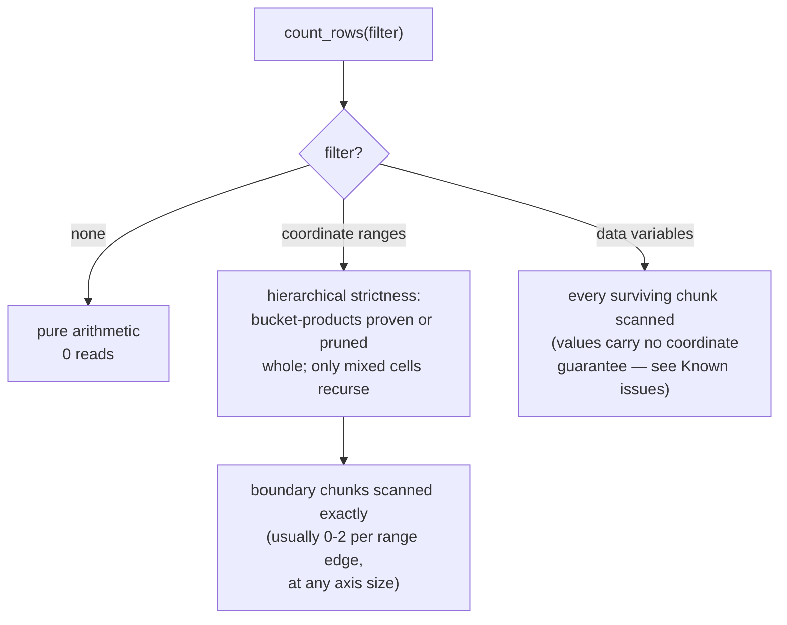

# Performance guide

How to get engine-limited speed out of registered xarray tables. Every
number below was measured on real cloud rasters (billions of pixels);
your mileage scales with network and core count, but the *ratios* are
structural.

## How a scan decides what to read

Every engine query over a registered table flows through one pipeline;
each tuning knob on this page acts on one of its stages:



Two invariants hold everywhere: pruning never decides correctness (the
exact expression is always applied — engines delete pushed conjuncts
from their own plans), and only what reaches `scanner()` can prune
(engines push plain comparisons, never function calls).

## Make the source read in parallel

The single biggest lever is usually the reader, not the engine.

**GeoTIFF / rioxarray**: `rioxarray.open_rasterio` serializes GDAL tile
reads behind a lock by default, capping every scan at single-stream
speed no matter how many threads the adapter runs. On GDAL ≥ 3.11 use
the natively thread-safe LIBERTIFF driver; on older GDAL pass
`lock=False`:

```python
da = rioxarray.open_rasterio(
    url, chunks={"x": 2048, "y": 2048},
    driver="LIBERTIFF",   # GDAL >= 3.11; else keep lock=False only
    lock=False,
)
```

Measured on a 9-billion-pixel public cloud GeoTIFF, full-table
aggregation: default open **277 s** → `lock=False` **43 s** →
LIBERTIFF + `GDAL_NUM_THREADS=ALL_CPUS` **24 s**. With parallel reads,
remote (`/vsicurl/`) matched a local copy of the same file — the
network was never the bottleneck, the lock was.

Remote-read environment preset worth exporting for `/vsicurl/` sources:

```python
os.environ.update(
    GDAL_NUM_THREADS="ALL_CPUS",
    GDAL_DISABLE_READDIR_ON_OPEN="EMPTY_DIR",
    VSI_CACHE="TRUE",
)
```

**Zarr**: zarr-python 3's async store defaults to only 10 concurrent
requests; raise it before opening remote stores:

```python
zarr.config.set({"async.concurrency": 128})
```

On a moderately sized windowed query (~40 chunks of 4096² uint8 per
variable, GCS) this was a modest gain (4.2 s → 3.7 s); it matters more
as chunk counts grow and chunks shrink. The obstore-backed
`zarr.storage.ObjectStore` is worth benchmarking for high-concurrency
workloads, but was not faster at this scale in our tests — measure
before switching.

## Choose chunk sizes for the scan, not just the store

Every chunk costs one prefetch task, one pivot call, and one shadow
fragment. Aim for **1–8 M rows per chunk** (e.g. 2048²–4096² pixels for
2-D grids). The same 10 M-row scan ran 1.7× faster in 4 chunks than in
20. Axes with hundreds of thousands of chunks still prune in
milliseconds (the shadow index is bucketed), but scanning them pays
per-chunk overhead.

## Tune the adapter knobs

```python
xql.register(con, "t", ds, prefetch=12, batch_size=262_144)
```

- `prefetch`: chunk loads kept in flight ahead of the engine. The
  default (4) saturates local CPU work; raise to 8–12 for remote
  sources where latency dominates. Memory scales with
  `prefetch × pivoted chunk size`.
- `batch_size`: rows per Arrow batch. The default (64 Ki) is fine;
  values between 64 Ki and 1 Mi measured within a few percent of each
  other.

## The memory contract

Peak scan memory is bounded by `prefetch × pivoted-block-size` plus the
engine's own aggregation state — it does not grow with the amount of
data scanned. Measured on ARCO-ERA5 over anonymous GCS: a one-month
full-globe aggregation (772M rows) peaks at the same RSS as the
one-week scan (174M rows), ~0.75 GB with the defaults.

`prefetch_bytes` caps *estimated bytes* in flight instead of block
count — set it when `coalesce_rows` makes blocks large or ragged.
The block size is the source chunk size unless `coalesce_rows` is set,
in which case in-flight units are merged blocks: raising
`coalesce_rows` buys fewer round-trips at proportionally higher peak
memory (`prefetch=16, coalesce_rows=8_000_000` peaked at ~1.2 GB on the
same scan while cutting wall time ~1.5-2x). Size the two together.

`count(*)`-shaped queries never pay scan memory at all: unfiltered
counts are pure chunk arithmetic, and filtered counts scan only the
boundary chunks the filter cannot prove — at any filter breadth; see
[What counting costs](#what-counting-costs).
## Let pushdown do its job

Selective queries are fast *because of their predicates*: bounding-box
`WHERE` clauses on dimension columns prune to intersecting chunks, and
only the variables a query references are read. Corollaries:

- Prefer explicit column lists over `SELECT *` on wide datasets.
- Spatial functions (`ST_Within`, ...) are not pushed down — pair them
  with a bounding-box predicate that is: the box prunes, the geometry
  refines.
- A query with no `WHERE` on dimension columns is a full scan on any
  engine; that's physics, not a missing optimization.

## Threads and DuckDB connections

Registered Python objects are connection-local in DuckDB: `con.cursor()`
does not inherit them, and one connection's result slot is not
thread-safe. For multithreaded querying, give each thread its own
cursor and register the *same* dataset object on it:

```python
dataset = xql.arrow_dataset(ds)
def worker():
    cur = con.cursor()
    cur.register("t", dataset)   # cheap; shares the pruning index
    ...
```

The dataset object itself is safe to share across threads (verified
under concurrent query load).

## What counting costs

`count(*)` never pays scan memory, and usually no I/O either:



Coordinate-range counts stay arithmetic at any breadth (a
near-universal filter over a million single-row chunks counts with
zero reads), and the strictness pass applies cross-dimension
information, so paired-range predicates count without reading the
cross combinations.

## Stop re-scanning: materialize and pyramid

Both helpers trade **one scan of the source** for cheap re-querying,
but they build different things for different question shapes:

| | `materialize` | `pyramid` |
|---|---|---|
| What it builds | any query's result, as a native engine table | a multi-resolution grid of pre-aggregated cells |
| Shape | whatever your `SELECT` returns | fixed: `(level, x_idx, y_idx, x_bin, y_bin, <aggs>)` |
| Answers | the *same* derived table, repeatedly | the *same statistics* at *different resolutions* |
| Think of it as | `CREATE TABLE AS SELECT`, sorted for the engine | raster overviews / map-tile pyramids, in SQL |

### `materialize`: cache one derived table

Use it when you keep querying the same derived shape — a class
histogram per degree cell, a daily series — and each run re-scans the
source. `materialize` runs the query once into a native table; pass
`order_by` with the coordinate columns so the engine's storage
compresses the repetitive coordinates and prunes range predicates with
zone maps:

```python
xql.materialize(con, "grid_cube",
    "SELECT FLOOR(y) AS lat, FLOOR(x) AS lon, klass, COUNT(*) AS n "
    "FROM grid GROUP BY 1, 2, 3",
    order_by=["lat", "lon"])

con.sql("SELECT * FROM grid_cube WHERE lat = -32")   # native speed
```

The table is exactly your query's rows — no more, no less. If you need
a different aggregation later, that is a new `materialize`.

The helper is deliberately thin: on DuckDB it issues exactly the
`CREATE OR REPLACE TABLE ... AS ... ORDER BY ...` you could write
yourself. Its value is portability — the same call works on
DataFusion, where raw DDL is a lazy plan that silently does nothing
until collected (the adapter collects it) — and making the
sort-for-compression idiom the default rather than something to
remember.

### `pyramid`: one cube, every zoom level

Use it when the *resolution* of the question varies — dashboards,
maps, "country then province then plot" drill-downs. `pyramid` scans
the source once, bins `x`/`y` into square cells of `base_cell`
coordinate units (level 0), then rolls each coarser level up from the
one below (cells double in size per level, so rollups are exact and
cost almost nothing beyond the single scan):

```python
xql.pyramid(con, "grid_pyramid", "grid",
    aggs={"n": ("count", "*"),
          "hits": ("sum", "CASE WHEN klass >= 4 THEN 1 ELSE 0 END")},
    base_cell=0.05, levels=6)

# Continental overview: a few thousand coarse cells, not 9B pixels.
con.sql("""
    SELECT x_bin, y_bin, hits / n AS rate
    FROM grid_pyramid
    WHERE level = 5
""")

# Zoomed-in region: same cube, finer level, range-filtered.
con.sql("""
    SELECT x_bin, y_bin, hits / n AS rate
    FROM grid_pyramid
    WHERE level = 1
      AND x_bin BETWEEN -58.5 AND -57.0 AND y_bin BETWEEN -29.0 AND -28.0
""")
```

Query the level whose cell size matches what you are rendering or
summarizing; filter `x_bin`/`y_bin` with ranges (they are float cell
origins), or join on the exact integer `x_idx`/`y_idx` when combining
levels or cubes.

Both helpers run the same way on DuckDB and DataFusion (they go through
the adapter's `run_sql` seam).

## The round-trip is optimized for grids

`xql.to_dataset` locates rows by arithmetic when an axis is uniformly
spaced (any regular raster or time step, ascending or descending) and
reshapes without any scatter when the result arrives grid-ordered.
Sparse or irregular results fall back to a positional scatter
automatically. If you want the raw sub-array of a registered Dataset
rather than a relational answer, plain `ds.sel(...)` is the direct
path — SQL adds value when the question is relational.

